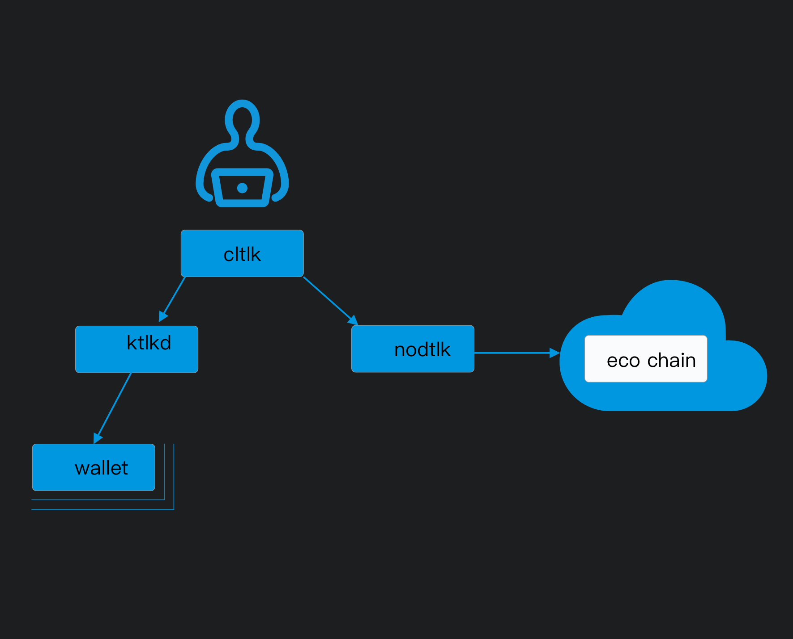

# TLKIO Overview

TLKIO is the next-generation blockchain platform for creating and deploying smart contracts and distributed applications. TLKIO comes with a number of programs. The primary ones included in TLKIO are the following:

* [nodtlk](01_nodtlk/index.md) (node + tlk = nodtlk)  - core service daemon that runs a node for block production, API endpoints, or local development.
* [cltlk](02_cltlk/index.md) (cli + tlk = cltlk) - command line interface to interact with the blockchain (via `nodtlk`) and manage wallets (via `ktlkd`).
* [ktlkd](03_ktlkd/index.md) (key + tlk = ktlkd) - component that manages TLKIO keys in wallets and provides a secure enclave for digital signing.

The basic relationship between these components is illustrated in the diagram below.

[[info | What's Next?]]
| [Install the TLKIO Software](00_install/index.md) before exploring the sections above.
